# ABAP-Database-Tables

Repository for managing and documenting SAP DDIC database tables. Includes table definitions, data elements, domain structures, and related ABAP code for data manipulation and integration.

## Introduction

This project is designed to streamline the management of employee and department data within SAP systems, ensuring data integrity and consistency.

## SAP DDIC Project: Employee and Department Tables

### Description

This project involves the creation and management of two SAP DDIC (Data Dictionary) tables: `ZEMPLOYEE_T` (Employee) and `ZDEPARTMENT_T` (Department). The SAP Data Dictionary is a central repository for metadata in SAP systems, providing a structured way to define and manage data objects.

### What is DDIC?

The SAP Data Dictionary (DDIC) is a crucial component of the SAP system, used to define and manage data structures. It ensures data consistency and integrity across the system by providing:

- **Centralized Data Definitions**: DDIC allows for the centralized definition of data elements, tables, views, and more, ensuring uniformity across applications.
- **Data Integrity**: DDIC helps maintain data integrity and consistency by defining relationships and constraints.
- **Performance Optimization**: Properly defined data structures can improve system performance and retrieval efficiency.

### Naming Conventions

- Every object, including tables and other data structures, should start with `Z` or `X` to indicate custom development.

### Relevant SAP Transaction Codes

- **SE11**: Data Dictionary - Use to create and manage data dictionary objects.
- **SE14**: Database Utility - Use for database table maintenance tasks like adjusting, deleting, or activating tables.
- **SE12**: Data Dictionary Display - Use to view table definitions.
- **SE16N**: General Table Display - Use to view and analyze table data.
- **SM30**: Table View Maintenance - Use to maintain table entries.

### Project Overview

#### `ZEMPLOYEE_T` Table

- **Purpose**: Stores employee information.
- **Key Fields**:
  - `MANDT`: Client
  - `EMP_ID`: Employee ID
  - `EMP_NAME`: Employee Name
  - `EMP_DOB`: Date of Birth
  - `EMP_GENDER`: Gender
  - `EMP_EMAIL`: Email Address
  - `EMP_PHONE`: Phone Number
  - `EMP_HIRE_DATE`: Hire Date
  - `DEPT_ID`: Department ID
  - `JOB_TITLE`: Job Title
  - `SALARY`: Salary
  - `MANAGER_ID`: Manager ID
  - `ADDRESS`: Address
  - `EMERGENCY_CONTACT`: Emergency Contact Name
  - `EMERGENCY_PHONE`: Emergency Contact Phone
  - `CREATED_BY`: Created By
  - `CREATED_DATE`: Created Date
  - `CHANGED_BY`: Changed By
  - `CHANGED_DATE`: Changed Date

#### `ZDEPARTMENT_T` Table

- **Purpose**: Stores department information.
- **Key Fields**:
  - `DEPT_ID`: Department ID
  - `DEPT_NAME`: Department Name
  - `LOCATION`: Location
  - `CREATED_BY`: Created By
  - `CREATED_DATE`: Created Date
  - `CHANGED_BY`: Changed By
  - `CHANGED_DATE`: Changed Date

#### `ZEMPLOYEE_STRUCT` Table

- **Purpose**: Used to track metadata for audit purposes in both `ZEMPLOYEE_T` and `ZDEPARTMENT_T` tables.

- **Key Fields**:
  - `CREATED_BY`: The user who created the entry
  - `CREATED_DATE`: Date of creation
  - `CHANGED_BY`: User who last modified the entry
  - `CHANGED_DATE`: Date of last modification

## Screens from Project:

  <em>The initial screen for creating and managing (DDIC) database tables in the ABAP Dictionary.</em>  
  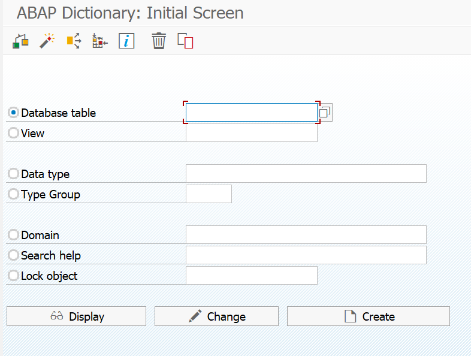

  <em>Diagram showing the foreign key relationship between ZDEPARTMENT_T and ZEMPLOYEE_T tables.</em>  
  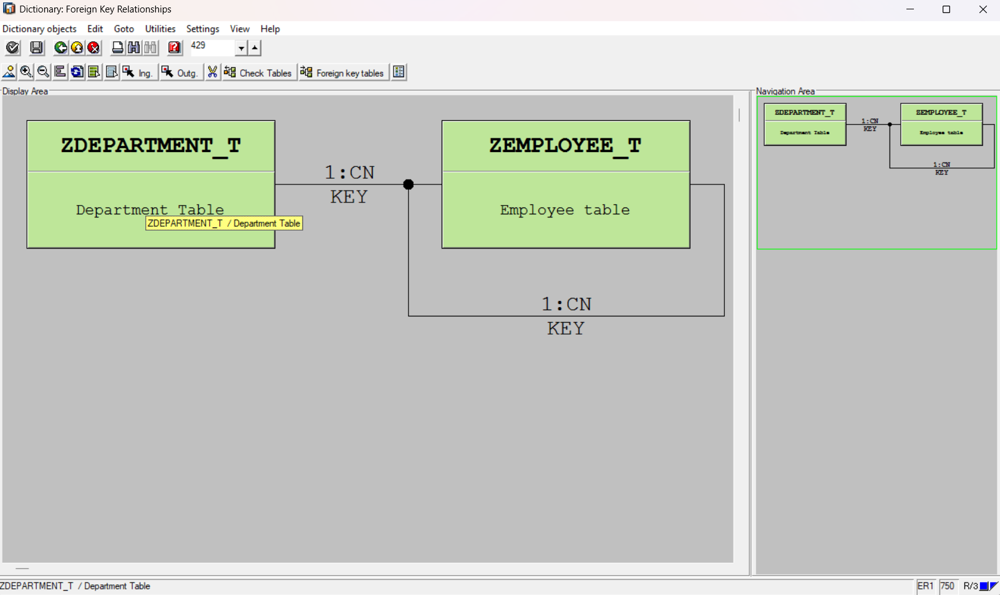

  <em>The ZEMPLOYEE_STRUCT structure is used in both the ZEMPLOYEE_T and ZDEPARTMENT_T tables to track metadata. It includes fields like CREATED_BY, CREATED_DATE, CHANGED_BY, and CHANGED_DATE, providing a consistent way to audit who created and modified records and when.</em>  
  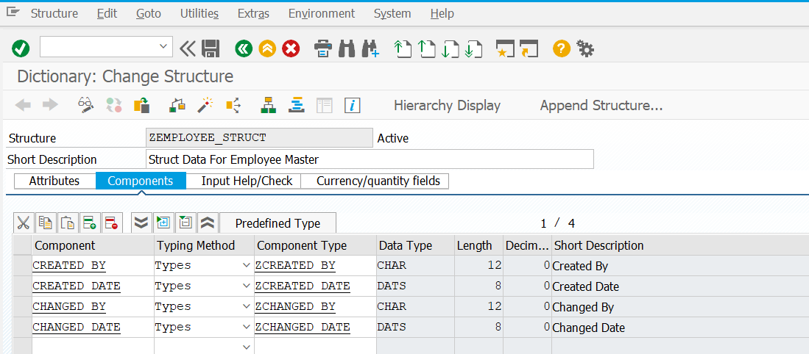

  <em>Structure of the ZEMPLOYEE_T table, detailing fields and data types.</em>  
  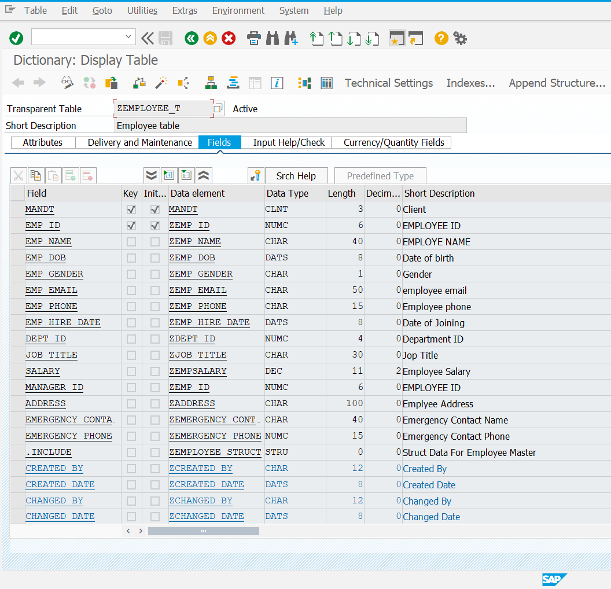

  <em>Structure of the ZDEPARTMENT_T table, showing fields and data types.</em>  
  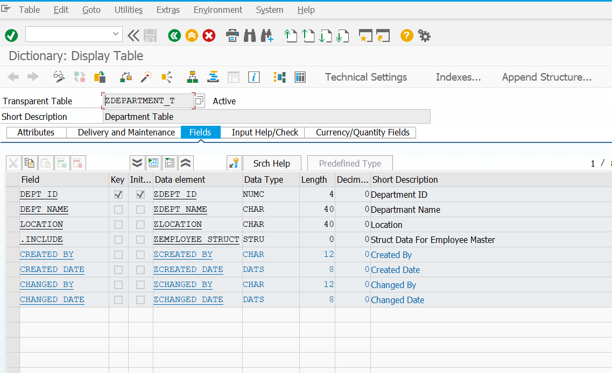

  <em>Data element ZEMP_ID for Employee ID, showing its domain and data type.</em>  
  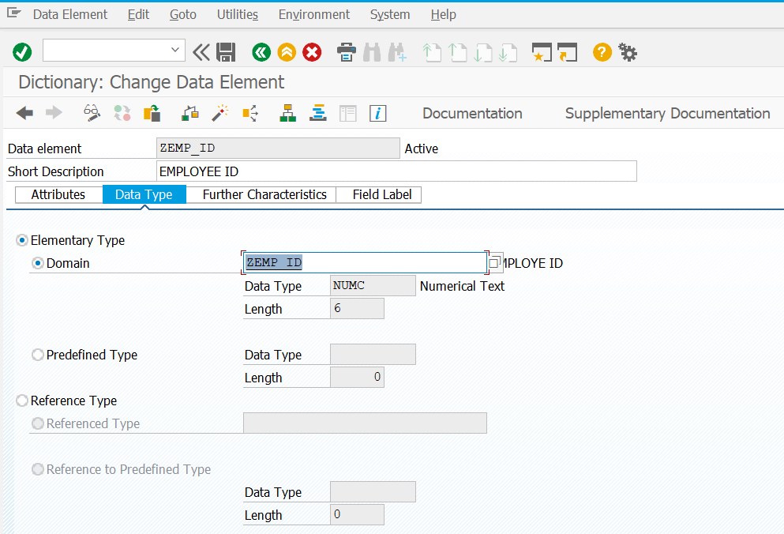

  <em>Field label settings for the ZEMP_ID data element, detailing different label lengths.</em>  
  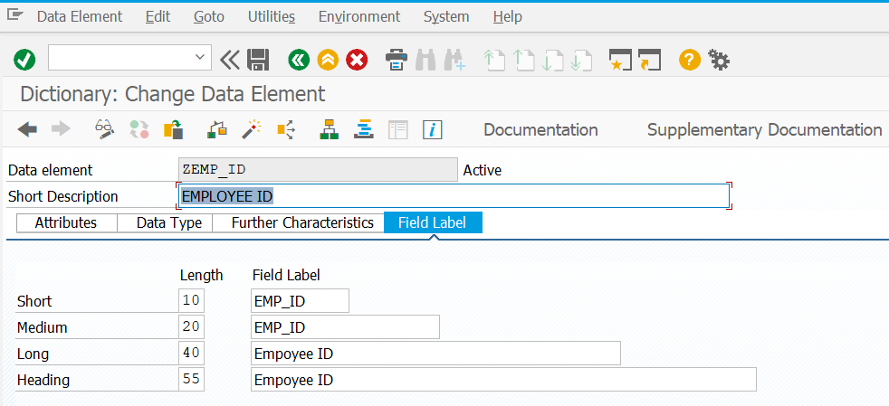

  <em>Display of the ZEMP_GENDER domain, showing the value range for gender options.</em>  
  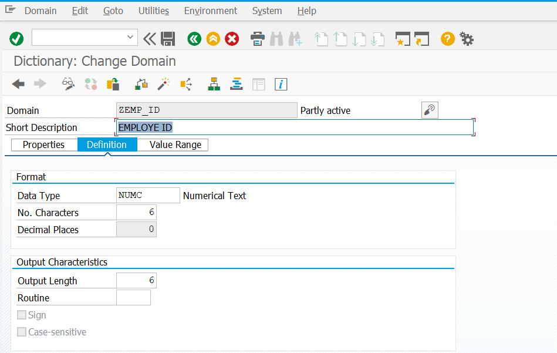

  <em>Domain definition for ZEMP_ID, specifying data type and format.</em>  
  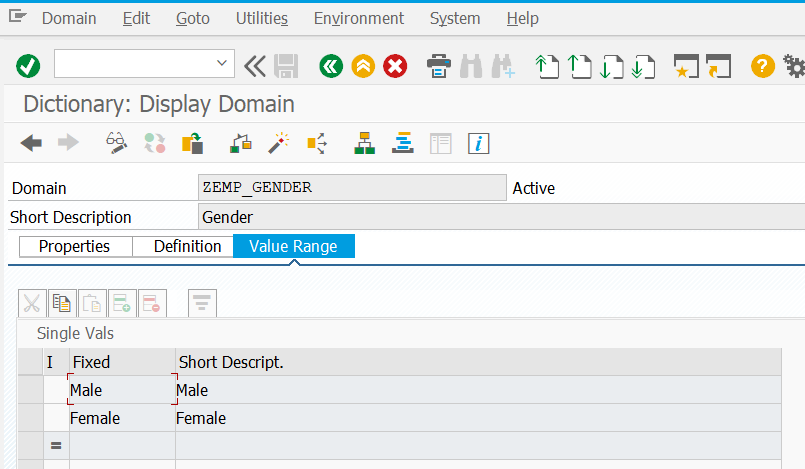

  <em>Access the Utilities menu to generate table maintenance events.</em>  
  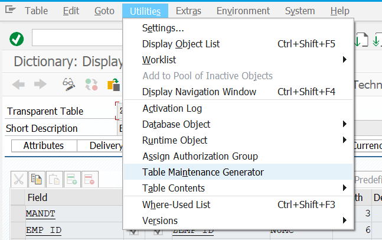

  <em>Settings for generating table maintenance dialogs for ZEMPLOYEE_T.</em>  
  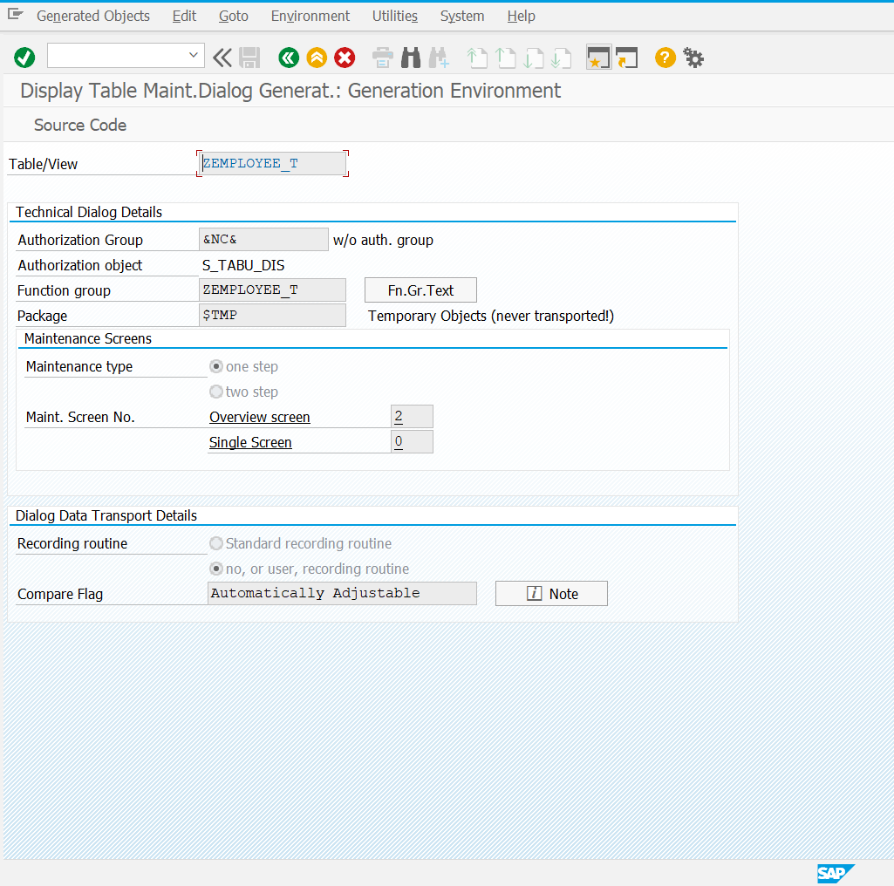

  <em>Navigate the Environment menu to access events and other settings.</em>  
  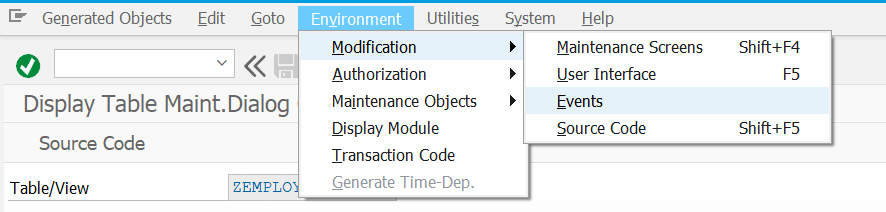

  <em>View and manage form routines for table maintenance in ZEMPLOYEE_T.</em>  
  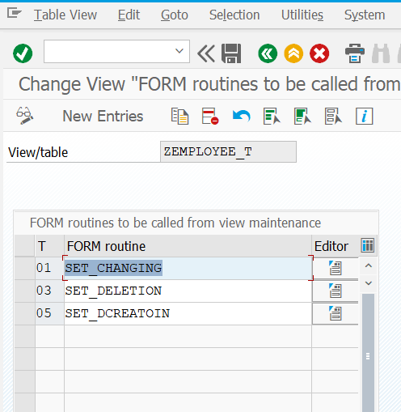

*********************************************************************************************************
*********************************************************************************************************
****************************************VIEWS************************************************************
*********************************************************************************************************
*********************************************************************************************************

<h2 align="center">Database View (ZEMPLOYEE_T_DV)</h2>

  A database view that combines data from employee and department tables, providing a comprehensive view of employee information along with their department details. This view is useful for reporting and data analysis purposes.

[Database View Screenshots]

  <em>Database View Configuration showing the join between ZEMPLOYEE_T and ZDEPARTMENT_T tables using DEPT_ID.</em>  
  

  <em>View Fields configuration displaying all fields from both tables with their respective data types and lengths.</em>  
  

  <em>Sample data showing the combined employee and department information from the database view.</em>  
  

<h2 align="center">Projection View (ZEMPLOYEE_T_PV)</h2>

  A projection view that selects specific fields from the employee table, offering a focused view of employee information. This view is particularly useful when only specific employee attributes are needed.

[Projection View Screenshots]

  <em>Projection View Configuration (ZEMPLOYEE_T_PV) shows selected employee table fields with their data elements and properties.</em>  
  

  <em>Sample data displaying employee information through the projection view, including personal details and department assignments.</em>  
  

<h2 align="center">Maintenance View (ZEMPLOYEE_T_MV)</h2>

  A maintenance view that enables data maintenance while preserving the relationship between employee and department information. This view is designed for data updates and modifications with referential integrity.

[Maintenance View Screenshots]

  <em>Maintenance View configuration showing the relationship between Employee and Department tables using DEPT_ID as the join condition.</em>  
  

  <em>View Fields configuration displaying all fields from both tables with their technical specifications including data elements, types, and lengths.</em>  
  

  <em>Sample data display from the Maintenance View (ZEMPLOYEE_T_MV) showing basic employee information like ID, DOB, Gender, and Email.</em>  
  

<h2 align="center">Help View (ZEMPLOYEE_T_HV)</h2>

  A help view that provides quick access to essential employee and department information. This simplified view is designed for reference purposes, showing only key fields needed for basic lookups.

[Help View Screenshots]

  <em>Help View join configuration displaying the relationship between Employee and Department tables using DEPT_ID field.</em>  
  

  <em>Help View (ZEMPLOYEE_T_HV) field configuration showing selected fields (EMP_ID, EMP_NAME, DEPT_NAME) with their technical details.</em>  
  

